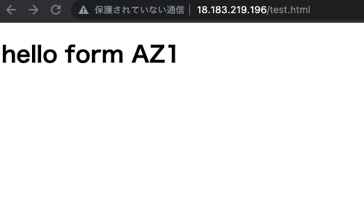
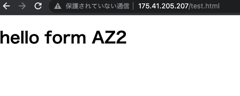
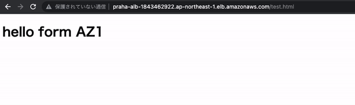
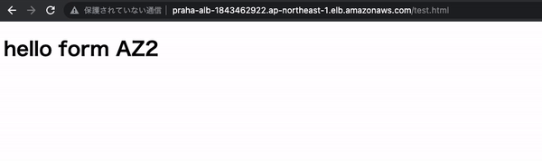

# 課題 1

## nginx の導入

・疑問

> ヒント：これまで作成してきた Security Group の設定だと SSH しか許可されていないため、インターネット経由でアクセス出来ないかもしれません。そんな時は Security Group の設定も見直してみましょう！

ってあるけど、private サブネットの場合はそもそもインターネット接続できないのでは？nat とか使うのかな？

一旦パブリックにして表示

az1

az2

## alb 入れた結果

・疑問
alb を作成するときに、インターネットゲートウェイに接続してるサブネットにしてくださいって出てたからそうしたんだけど、課題通りプライベートサブネットでやるべきだったのか

両方がいきてる場合

1 を停止した場合

