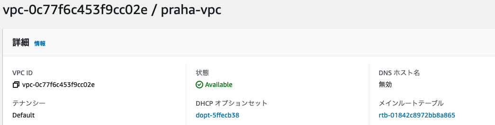
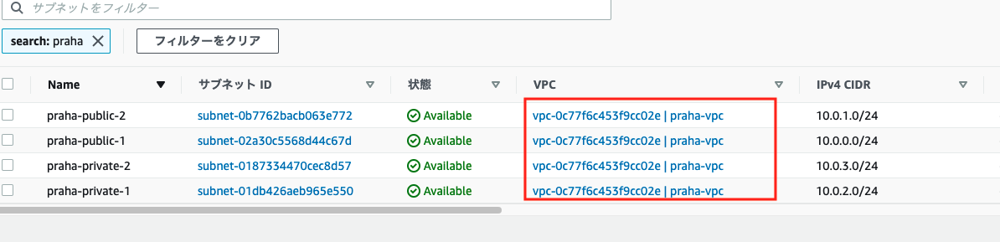
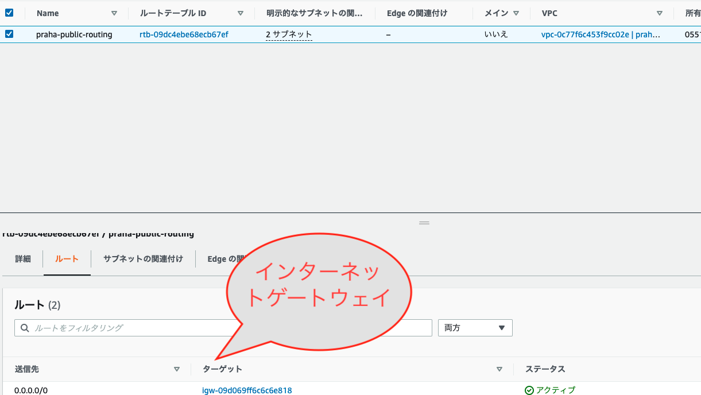
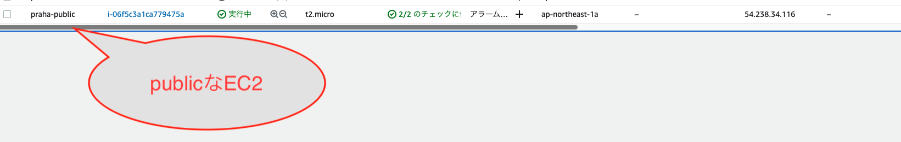

# 課題 1

## プライベートサブネットとパブリックサブネットの違い

パブリックサブネットはインターネットと通じており、一般公開されるサブネット。プライベートサブネットはインターネットと通じていないサブネット。
データベースなどの一般に公開しないものはプライベートに、Web サーバなどの一般に公開するものはパブリックサブネットに配置することが多い。

## VPC にプライベートサブネットとパブリックサブネットをマルチ AZ で構成

VPC


subnet


publicrouting


private なものは上記の routing にしてない

## パブリックサブネットに SSH 可能な EC2 インスタンスを立てて、アクセス



```
$ ssh -i "praha-ec2.pem" ec2-user@54.238.34.116
Warning: Permanently added '54.238.34.116' (ED25519) to the list of known hosts.

       __|  __|_  )
       _|  (     /   Amazon Linux 2 AMI
      ___|\___|___|

https://aws.amazon.com/amazon-linux-2/
```

## プライベートサブネットにも EC2 インスタンスを立てて、パブリックサブネットの EC2 インスタンスからのみプライベートサブネットの EC ２インスタンスに SSH でアクセス可能に

## プライベートサブネットに VPC の外から
