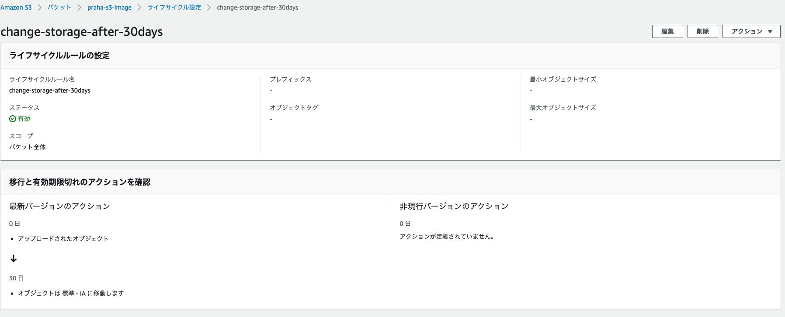
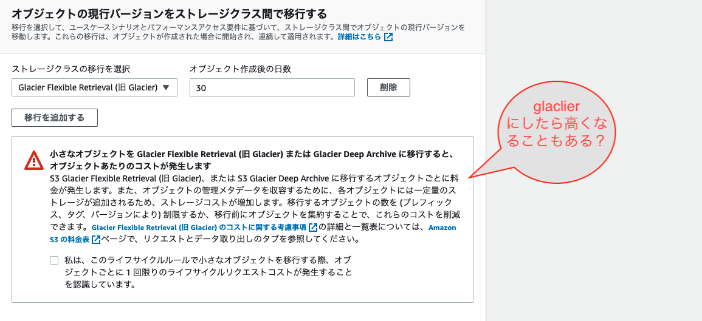
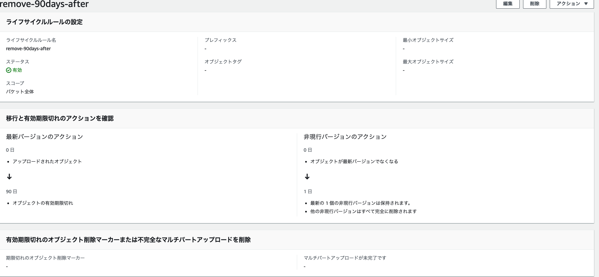
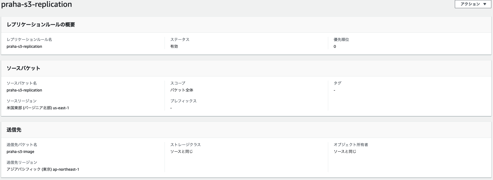
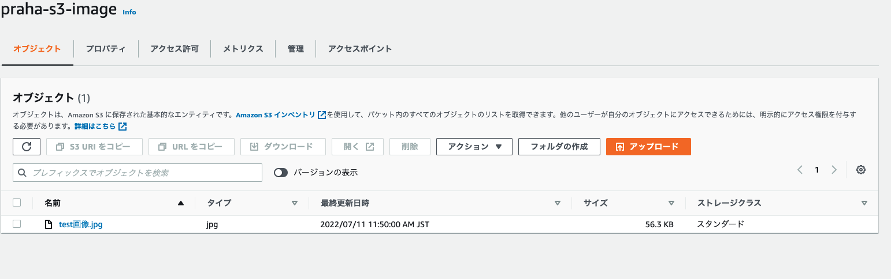
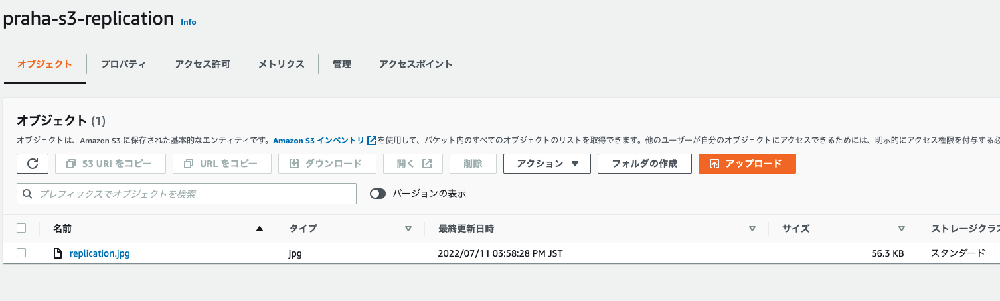
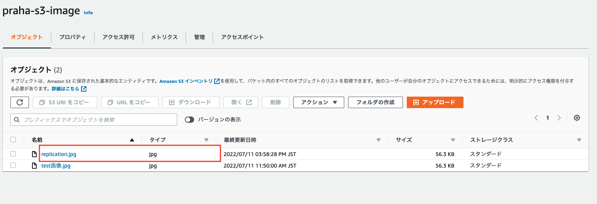

# 課題 1（ストレージクラス）

## ストレージクラス

### 種類

1. S3 Standard

   頻繁にアクセスされるデータ向け

2. S3 Standard-IA

   存続期間が長くあまり頻繁にアクセスされないデータ向け

3. S3 Intelligent-Tiering

   アクセスパターンが変化、または不明な存続期間が長いデータ向け

4. S3 One Zone-IA

   存続期間が長くあまり頻繁にアクセスされない、且つ重要度の低いデータ向け

5. S3 Glacier

   取得時間が数分から数時間許容される長期アーカイブデータ向け

6. S3 Glacier Deep Archive

   取得時間が 12 時間許容される長期アーカイブデータ向け

### ほとんどアクセスされないバケットを作成する場合

ほとんどアクセスされないの頻度による。

「ほぼない」で取得時間が数時間許容されるなら、`S3 Glacier`で、12 時間許容されるなら`S3 Glacier Deep Archive`

「頻繁ではない」で重要なデータなら`S3 Standard-IA`で重要じゃないデータなら`S3 One Zone-IA`

## ライフサイクル

### ライフサイクルとは？

ある期間やルールを設定し、それを基に自動で、ストレージクラスを移動したり保存されているドキュメントなどを削除することができる機能。

### 30 日経ったら安い storage に移行するライフサイクル

以下のスクショ
30 日経ったら `Standard-IA` に移行

アクセス頻度考えると `Glacier` がより安くていいかと思ったが、高くなる可能性もある？とのことで`Standard-IA`に。

### 90 日経ったら log ファイルを削除するライフサイクル

# 課題２（バックアップ）

## 「バージョニング」と「レプリケーション」の違い

バージョニングは、単一のオブジェクトの複数のバージョンを保持できるようになる機能です。操作ミスによる削除に対しても、簡単に復旧できる手段を提供してくれます。

レプリケーションは、Amazon S3 のバケット全体のオブジェクトを自動で非同期的にコピーする機能です。複数の対象バケットにも可能で、リージョンを跨いでも可能。

## レプリケーション

レプリケーション設定

レプリケーション先のバケット(まだレプリケーション画像ない)

レプリケーションもとのバケットに画像をアップ

レプリケーション先のバケット

赤枠が追加された画像

## バージョニング
