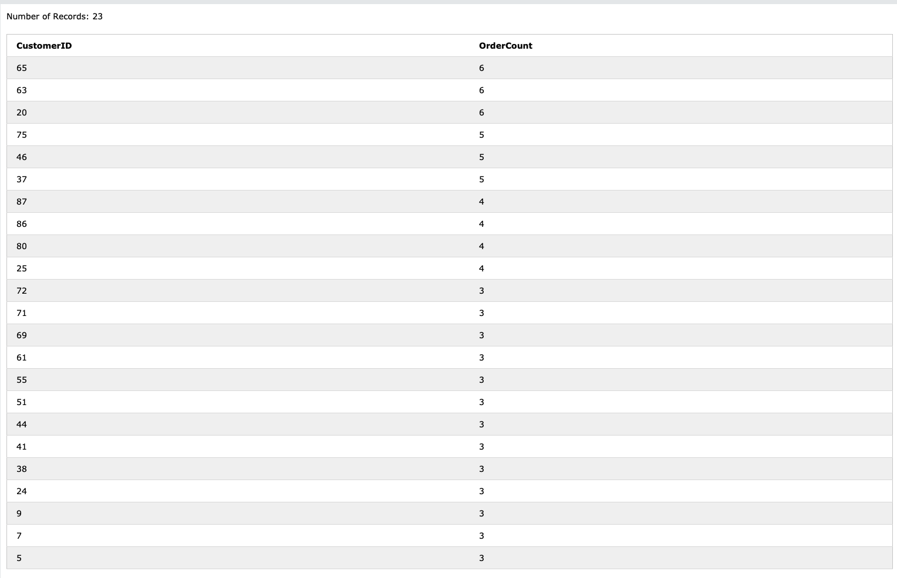
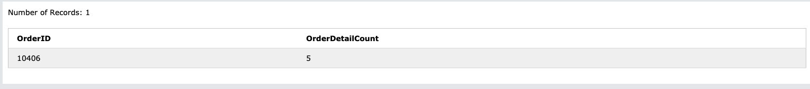
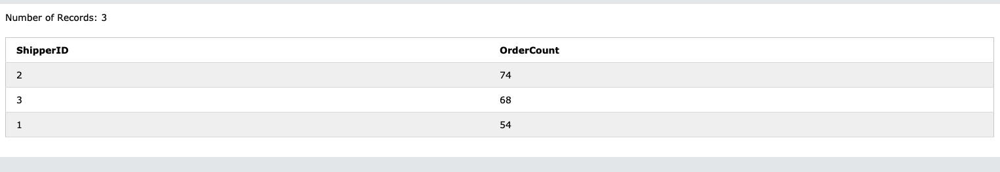
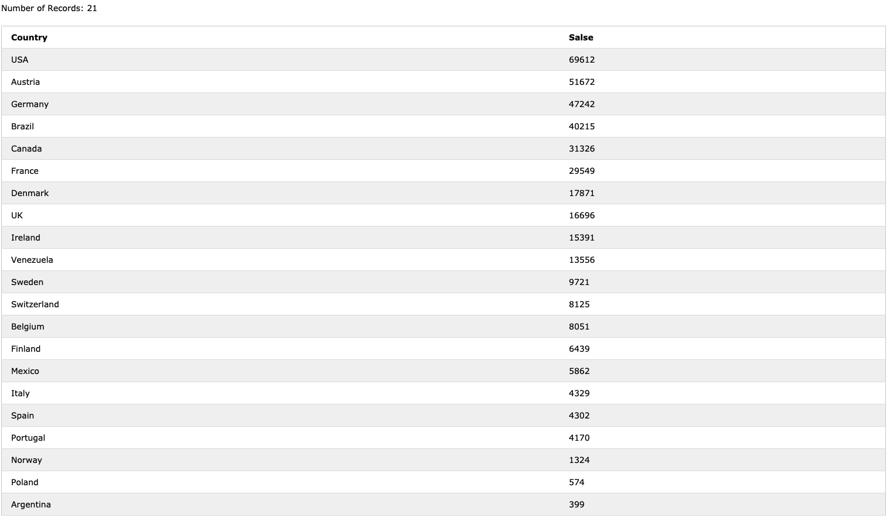
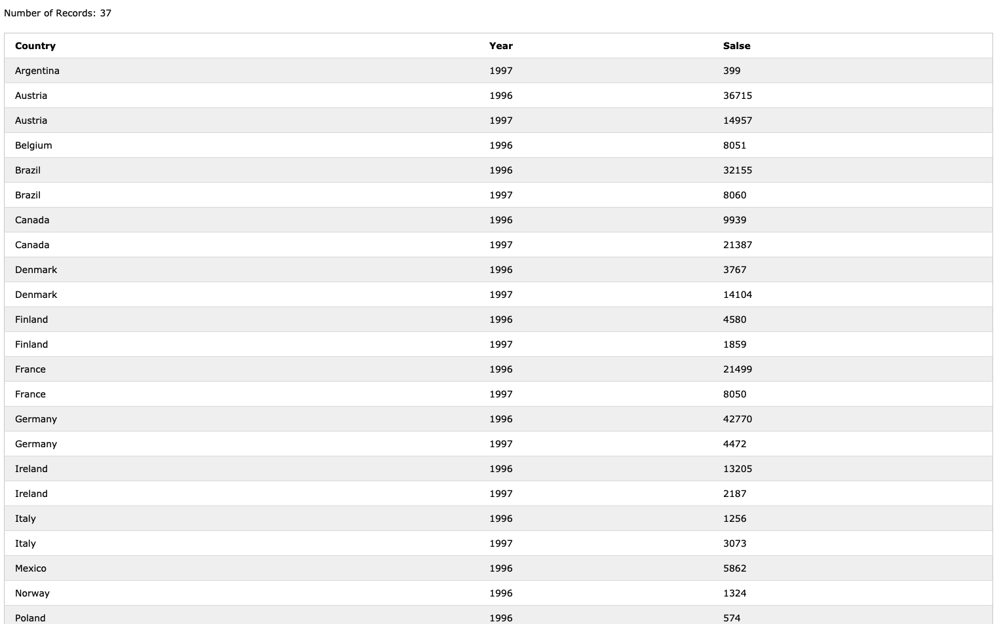

### 96 年に 3 回以上注文した（Orders が 3 つ以上紐づいている）Customer の id と、注文回数

```
SELECT Customers.CustomerId, COUNT(Orders.OrderId) as OrderCount
FROM Customers
JOIN Orders ON Customers.CustomerId = Orders.CustomerID
            AND Orders.OrderDate BETWEEN '1996-01-01' AND '1996-12-31'
GROUP BY Customers.CustomerId
HAVING OrderCount >= 3
ORDER BY OrderCount DESC
```

スクショ


一番注文したのは、
id が 65、63、20 の顧客

### 過去、最も多くの OrderDetail が紐づいた Order を取得してください。何個 OrderDetail が紐づいていたでしょうか？

```
SELECT OrderID, COUNT(OrderId) as OrderDetailCount
FROM OrderDetails
GROUP BY OrderID
ORDER BY OrderDetailCount DESC
LIMIT 1
```

スクショ


最大 5 個

### Order 数が多い順番に Shipper の id を並べてください。Order 数も表示してください

```
SELECT ShipperID,COUNT(OrderID) as OrderCount
FROM Orders
GROUP BY ShipperID
ORDER BY OrderCount DESC
```

スクショ


### 売上が高い順番に Country を並べてください。売上も表示してください

```
SELECT Customers.Country, ROUND(SUM(OrderDetails.Quantity * Products.Price)) as Salse
FROM Customers
JOIN Orders ON Orders.CustomerID = Customers.CustomerID
JOIN OrderDetails ON OrderDetails.OrderID = Orders.OrderID
JOIN Products ON Products.ProductID = OrderDetails.ProductID
GROUP BY Customers.Country
```

スクショ


### 国ごとの売上を年ごとに集計する

```
SELECT Customers.Country, strftime('%Y',Orders.OrderDate) as Year, ROUND(SUM(OrderDetails.Quantity * Products.Price)) as Salse
FROM Customers
JOIN Orders ON Orders.CustomerID = Customers.CustomerID
JOIN OrderDetails ON OrderDetails.OrderID = Orders.OrderID
JOIN Products ON Products.ProductID = OrderDetails.ProductID
GROUP BY Customers.Country, Year
ORDER BY Customers.Country, Year ASC
```

スクショ

