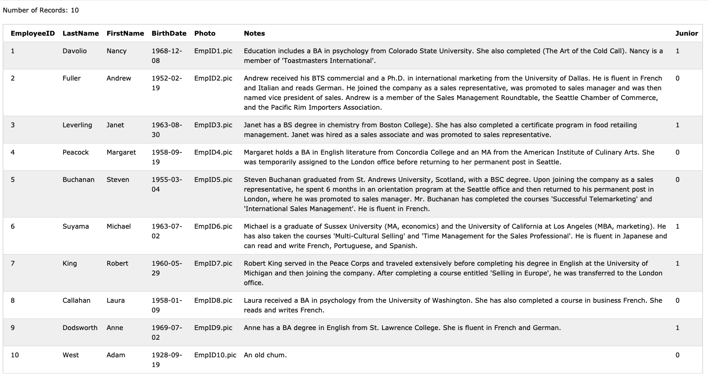
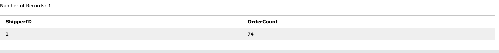
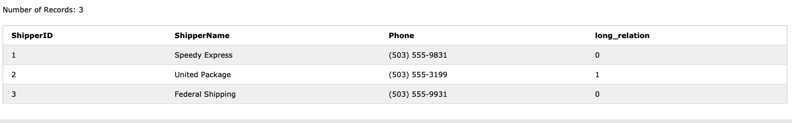
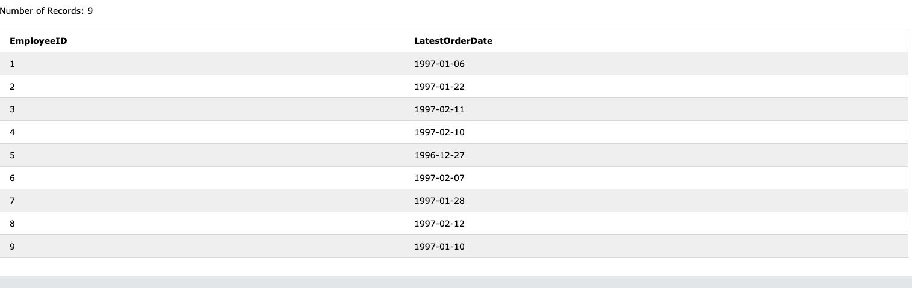
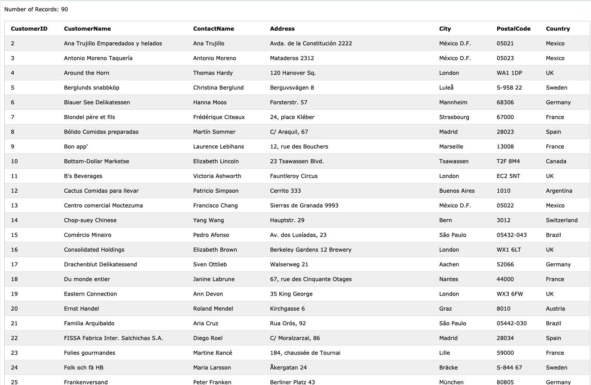
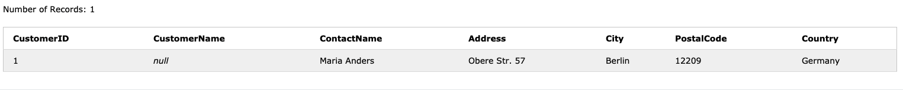
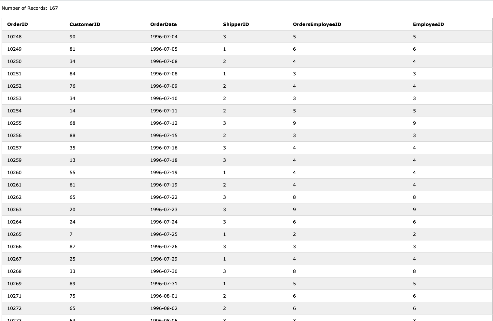
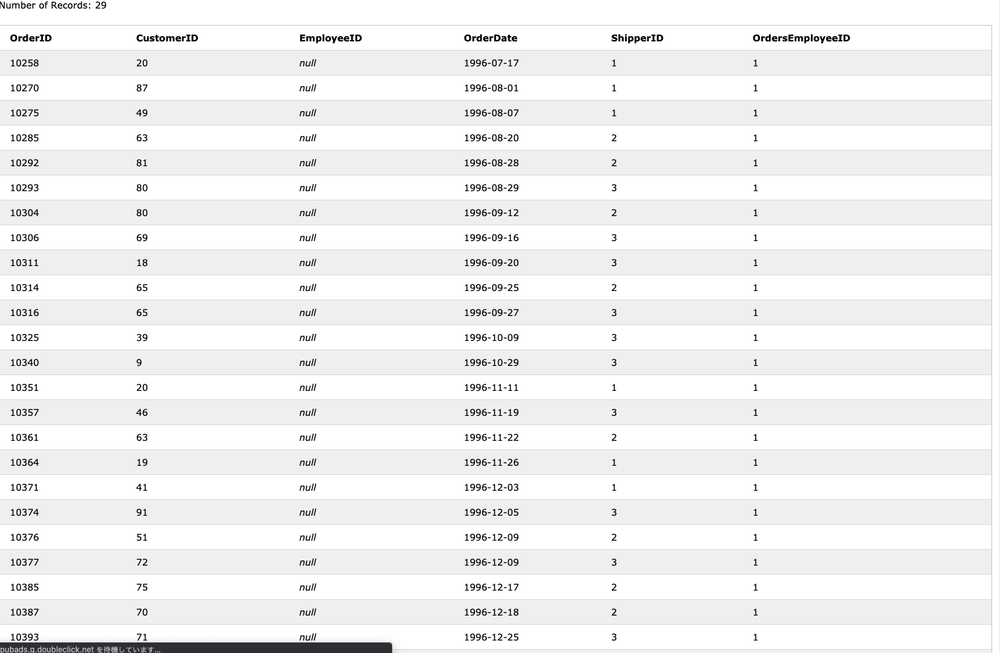

### 96 年に 3 回以上注文した（Orders が 3 つ以上紐づいている）Customer の id と、注文回数

```
SELECT Customers.CustomerId, COUNT(Orders.OrderId) as OrderCount
FROM Customers
JOIN Orders ON Customers.CustomerId = Orders.CustomerID
            AND Orders.OrderDate BETWEEN '1996-01-01' AND '1996-12-31'
GROUP BY Customers.CustomerId
HAVING OrderCount >= 3
ORDER BY OrderCount DESC
```

スクショ


一番注文したのは、
id が 65、63、20 の顧客

### 過去、最も多くの OrderDetail が紐づいた Order を取得してください。何個 OrderDetail が紐づいていたでしょうか？

```
SELECT OrderID, COUNT(OrderId) as OrderDetailCount
FROM OrderDetails
GROUP BY OrderID
ORDER BY OrderDetailCount DESC
LIMIT 1
```

スクショ


最大 5 個

### Order 数が多い順番に Shipper の id を並べてください。Order 数も表示してください

```
SELECT ShipperID,COUNT(OrderID) as OrderCount
FROM Orders
GROUP BY ShipperID
ORDER BY OrderCount DESC
```

スクショ


### 売上が高い順番に Country を並べてください。売上も表示してください

```
SELECT Customers.Country, ROUND(SUM(OrderDetails.Quantity * Products.Price)) as Salse
FROM Customers
JOIN Orders ON Orders.CustomerID = Customers.CustomerID
JOIN OrderDetails ON OrderDetails.OrderID = Orders.OrderID
JOIN Products ON Products.ProductID = OrderDetails.ProductID
GROUP BY Customers.Country
```

スクショ


### 国ごとの売上を年ごとに集計する

```
SELECT Customers.Country, strftime('%Y',Orders.OrderDate) as Year, ROUND(SUM(OrderDetails.Quantity * Products.Price)) as Salse
FROM Customers
JOIN Orders ON Orders.CustomerID = Customers.CustomerID
JOIN OrderDetails ON OrderDetails.OrderID = Orders.OrderID
JOIN Products ON Products.ProductID = OrderDetails.ProductID
GROUP BY Customers.Country, Year
ORDER BY Customers.Country, Year ASC
```

スクショ


### Employee テーブルに「Junior（若手）」カラム（boolean）を追加

Junior の追加

```
ALTER TABLE Employees
ADD Junior boolean;
```

若手の更新

```
UPDATE Employees SET Junior = true
WHERE BirthDate >= '1960-01-01'
```

若手じゃない人の更新

```
UPDATE Employees SET Junior = false
WHERE BirthDate < '1960-01-01'
```

スクショ


### Shipper に long_relation カラム（boolean）を追加

long_relation の追加

```
ALTER TABLE Shippers
ADD long_relation boolean;
```

long_relation が true になるべき Shipper レコードを特定

```
SELECT ShipperId, COUNT(OrderID) as OrderCount
FROM Orders
GROUP BY ShipperID
HAVING OrderCount >= 70
```

スクショ


更新

```
UPDATE Shippers SET long_relation = true
WHERE ShipperId = '2'
```

```
UPDATE Shippers SET long_relation = false
WHERE ShipperId != '2'
```

最終的な出力の
スクショ


### それぞれの Employee が最後に担当した Order と、その日付

```
SELECT Employees.EmployeeID, Max(OrderDate) as LatestOrderDate
FROM Orders
JOIN Employees ON Orders.EmployeeID = Employees.EmployeeID
GROUP BY Employees.EmployeeID
```

スクショ


### NULL の扱いに慣れる

任意の 1 レコードを Null に

```
UPDATE Customers SET CustomerName = Null
WHERE CustomerID = 1
```

CustomerName が存在するユーザを取得するクエリ

```
SELECT * FROM Customers
WHERE CustomerName IS NOT NULL

```

スクショ


CustomerName が存在しない（NULL の）ユーザを取得

```
SELECT * FROM Customers
WHERE CustomerName IS NULL
```

スクショ


### JOIN の扱いになれる

EmployeeId=1 の従業員のレコードを、Employee テーブルから削除

```
DELETE FROM Employees
WHERE EmployeeID = 1
```

EmployeeId=1 が担当した Orders を表示しないクエリ

```
SELECT Orders.OrderID, Orders.CustomerID, Orders.OrderDate, Orders.ShipperID, Orders.EmployeeID as OrdersEmployeeID, Employees.EmployeeID
FROM Orders
JOIN Employees ON Orders.EmployeeID = Employees.EmployeeID
```

スクショ


EmployeeId=1 が担当した Orders を表示するクエリ

```
SELECT Orders.OrderID, Orders.CustomerID, Employees.EmployeeID, Orders.OrderDate, Orders.ShipperID, Orders.EmployeeID as OrdersEmployeeID
FROM Orders
LEFT OUTER JOIN Employees ON Orders.EmployeeID = Employees.EmployeeID
WHERE Employees.EmployeeID IS NULL
```

スクショ

