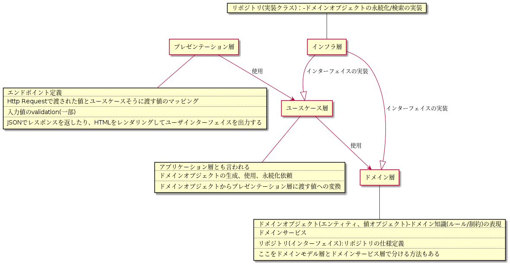

## 課題１

### オニオンアーキテクチャ図解

### 中心に位置するドメインモデル層は他のどの層にも依存していなメリット

ドメイン層を特定の技術に依存させず、独立したそうとして実装できること。

### 層をまたいで依存関係が発生する時（例えばユースケース層がレポジトリ層のメソッドを呼び出す時など）はインターフェースに対する依存のみ許可するメリット

インターフェースに対する依存のみにすることで、各層の変更が影響することを最小限に抑えられる。（インターフェースにのみ関心を持てば良くて、中の実装に対しては関心を持たなくていい。）

### 「依存性の逆転」がオニオンアーキテクチャにおいてどのように使われているか

ドメイン層とインフラ層の依存関係を逆転させてる。リポジトリのインターフェースをドメイン層にに、実装クラスをインフラ層に定義することで、依存の方向性を実装クラスからインターフェースになる。

### 特定のユーザにしかリソースの追加や更新を許さないようなアクセス制限機能を実装する場合、どの層に記述するのが適切か

ドメインサービス層かユースケース層に実装する。

### データベースを MySQL から PostgreSQL に変更する場合、どの層を変更する必要があるか

インフラ層
