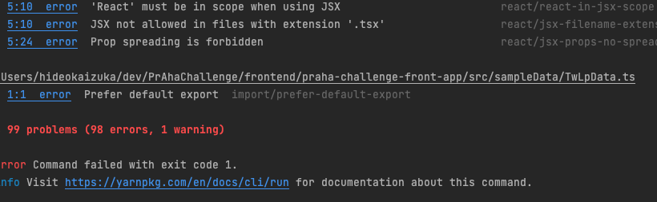

## 課題1（質問）

### チーム開発でlintを使うべき理由
1. コードの構造上の品質に関する問題を特定してくれて、品質の高いコードを維持するのに役に立つ。
2. コードを書き方にはメンバーそれぞれの好み・癖があるが、チームで開発をする場合はある程度書き方を揃えた方がよく、コーディング規約を設ける場合もある。コーディング規約の細かいところを人がいちいちレビューでチェックすると、時間・手間がかかる。細かいところはlintツールに任せて、人は機能の開発により集中できるようにした方がいいため。


### 参考
https://qiita.com/massa142/items/6639f9ecabcd84bbfe73
https://note.com/navitime_tech/n/nd61da833a838

### ESLintのルールの中から、最重要だと感じるルールを5つ
1. [no-cond-assign](https://eslint.org/docs/latest/rules/no-cond-assign)
   1. if, for, while, and do...whileの条件式で代入演算子（=など）を許可しない。 
2. [no-constant-condition](https://eslint.org/docs/latest/rules/no-constant-condition)
   1. 条件に定数式入れるのを許さない。
3. [no-obj-calls](https://eslint.org/docs/latest/rules/no-obj-calls)
   1. グローバルオブジェクトを関数として呼び出すことを許可しない。
4. [no-extra-boolean-cast](https://eslint.org/docs/latest/rules/no-extra-boolean-cast)
   1. 不必要なboolean型の型変換を許可しない。
5. [no-debugger](https://eslint.org/docs/latest/rules/no-debugger)
   1. debuggerの使用を許可しない。console.logのやつも入れたかった

### airbnbを試す

### 対象
frontend/praha-challenge-front-app

installコマンド
```
npx install-peerdeps --dev eslint-config-airbnb
```

設定した後にlint:fixしたら、以下のようにエラーだらけになりました。



この課題は直すことはせずにlintの設定を戻しました。

### 参考
https://eslint.org/docs/latest/rules/
https://www.tam-tam.co.jp/tipsnote/javascript/post11934.html
https://qiita.com/M-ISO/items/f9097a75b362206c2a99
https://www.npmjs.com/package/eslint-config-airbnb

# 課題2

```
yarn add -D husky lint-staged
```

```
yarn husky install
```

## 参考
https://fwywd.com/tech/husky-setup
https://walking-succession-falls.com/%E6%B7%B1%E3%81%84%E3%83%87%E3%82%A3%E3%83%AC%E3%82%AF%E3%83%88%E3%83%AA%E9%9A%8E%E5%B1%A4%E3%81%ABhuskey%E3%82%92%E9%81%A9%E7%94%A8%E3%81%99%E3%82%8B%E5%A0%B4%E5%90%88%E3%81%AE%E6%89%8B%E9%A0%86
https://zenn.dev/okkun/articles/f74cb21dcdefc1
https://qiita.com/maejima_f/items/5eb8a4067e3aa6a3179d
https://soudai-s.com/how-to-set-up-husky-v7-with-lint-staged