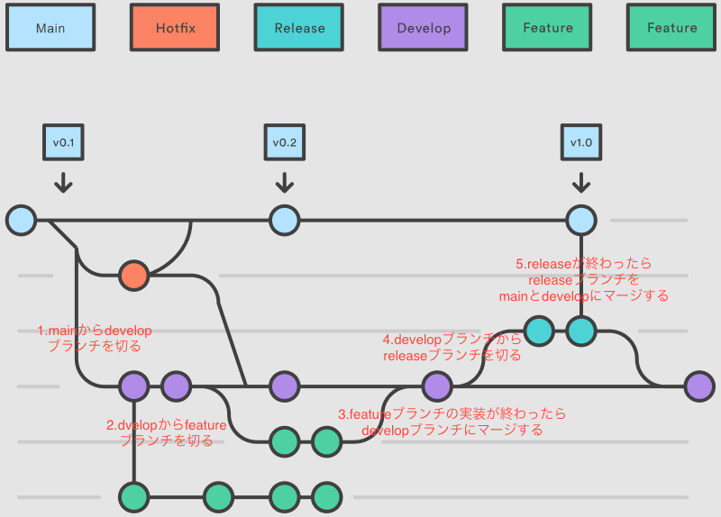

# 課題１

## GitHub Flow

説明は図の中にあります。

参考
https://www.figma.com/community/file/1108313068654086673
を元に図を作りました。

## Gitflow

疑問、5.release ブランチから develop にマージするときに差分ってあるかな？いるかな？

## それぞれのメリットデメリット

### GitHub Flow

#### メリット

1. ブランチ運用が簡単・シンプル
2. リリースを毎日やるようなところに向いてる
3. レビューが通ったら、即 master 反映なので、緊張感を持ったレビューが行える

#### デメリット

1. ステージング環境など様々な環境があるときにいつの時点?どのブランチ?がわかりにくくなりそう

### Gitflow

#### メリット

1. feature、develop、release といくつかの手順を踏む際に確認も入るのでミスは減るかも
2. ステージング環境など様々な環境がある時にどのブランチのが反映されてるかなどがわかりやすい(devlop ブランチは develop 環境とか)

#### デメリット

1. GitHub Flow に比べると面倒
2. 手順が複雑化することで逆にミスも増える可能性もある

## 参考

1. https://atmarkit.itmedia.co.jp/ait/articles/1708/01/news015.html
2. https://qiita.com/tlta-bkhn/items/fc485a66dbe48ec3b919
3. https://qiita.com/ogomr/items/36350d515434d6674caa
