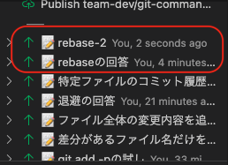
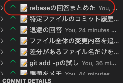

#　課題 1

## Git コマンド

### 特定のコミットとの差分を表示

```
git diff <コミット ID1> <コミット ID2>
```

#### 参考

https://qiita.com/nishina555/items/1c2c9ee385539cf4e27e
https://qiita.com/kasyuu/items/bc8489831e200b641456

### 差分があるファイル名だけを一覧で表示

```
git diff --name-only
```

### ファイル全体の変更内容を追加するのではなく、部分的に選択しながらステージングしたい

```
git add -p <ファイル名>
```

#### 参考

https://qiita.com/cotton_desu/items/bf08ac57d59b37dd5188

### ここまで加えた変更内容を一時的に退避させたい

```
git stash -u
```

退避したやつの一覧みる

```
git stash list
```

退避したものを戻す

```
git stash apply stash@{0}
```

※stash@{0}は stash list で見る

#### 参考

https://qiita.com/chihiro/items/f373873d5c2dfbd03250

### 特定ファイルのコミット履歴を見たい

```
git log <ファイル名>
```

#### 参考

https://www-creators.com/archives/1782

### 作業中、自分のローカル環境で細かく作業をコミットしていたため、複数に分かれたコミットを 1 つのコミットにまとめてからプッシュしたい（問題があったときにロールバックしやすいよう、意味のある単位でコミットをまとめる際に役立つ）

```
git rebase　-i HEAD~3
```

※3 はどのくらいのコミットを表示するか

コミットを表示した上で、
pick になっているのを squash する

before



after


#### 参考

https://backlog.com/ja/git-tutorial/stepup/32/
https://dev.classmethod.jp/articles/git-commit-matomeru/

### 特定のブランチを元に新たなブランチを作成したい

```
git checkout -b <新しいブランチ名> <元にするブランチ名>
```

#### 参考

https://qiita.com/yukachin0414/items/ecc890e8b4ebee457238

### リモートリポジトリをクローンする際に全てのコミット履歴が必要なく、最新コミットだけクローンしたい（clone にかかる時間を短縮するのに役立ちます）

```
git clone -depth 1
```

#### 参考

https://qiita.com/usamik26/items/7bfa61b31344206077fb
https://senooken.jp/post/2022/08/11/6377/

### 他ブランチからのマージ中にコンフリクトが発生したため、ひとまずマージを中断したい

編集する前

```
git merge --abort
```

編集したあと

```
git reset --hard HEAD
```

#### 参考

https://qiita.com/chihiro/items/5dd671aa6f1c332986a7
