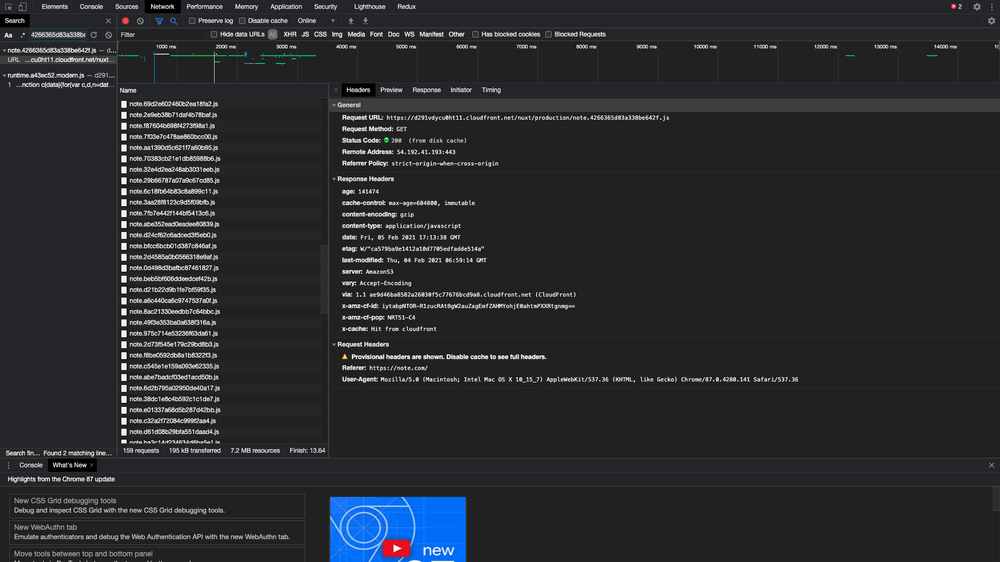
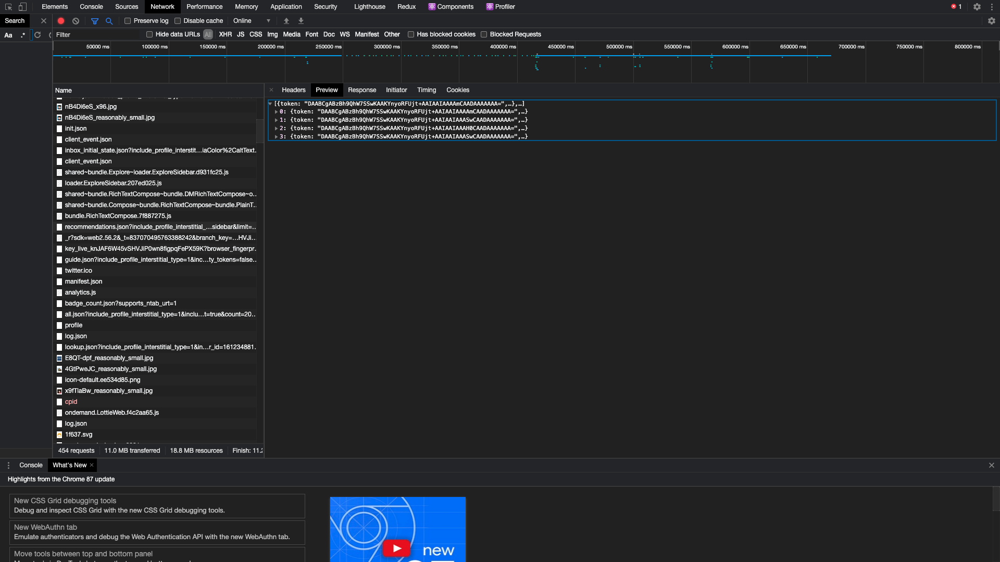

# 課題 1（質問）

## なぜキャッシュが必要か

WEB サービスの高速化のために必要です。WEB サービスを動かすためには様々なファイルをサーバより取得する必要があります。ただ。ファイルを毎回新しく取得すると、ページを表示するまでに時間がかかってしまいます。そこで、一度取得したものを再度利用して、必要なもののみを取得して WEB サービスを高速する仕組みがキャッシュです。

## キャッシュの違い

### ブラウザキャッシュ

ブラウザに紐づくキャッシュです。各々のブラウザに紐づくので、個々のユーザーのために使われます。例えば、ユーザー A がパソコン A でブラウザ A を使っていた場合、このブラウザ A にのみキャッシュが使用されます。ブラウザの戻る/進む、ページ保存、ソースの表示などはブラウザのキャッシュによって可能になっています。

### プロキシキャッシュ

プロキシサーバでは、サーバから取得したデータをプロキシサーバ上のローカルディスク上に一時的に格納することができます。これにより高速な応答を可能にしてます。ブラウザキャッシュとは異なり、基本的には共有されうるものです。

1. DNS サーバのキャッシュ
   ドメインと IP アドレスの対応表を管理しているサーバを権威サーバといいますが、Web ページにアクセスされるたびに、この権威サーバにアクセスしていたら権威サーバの負荷は相当重くなってしまいます。ドメインと IP アドレスの対応が変わることはそうそうないので、こちらもキャッシュが使われます。通常は、企業などの組織単位ごとのネットワークごとに DNS のキャッシュサーバを置いてそちらを利用します。

## キャッシュ制御のヘッダー

### Expires

Expires ヘッダーに日時を指定すること、指定された日時以内であれば、キャッシュが新鮮ということで、強制的にキャッシュを利用するようになります。

※レスポンスに max-age または s-maxage が指定された Cache-Control ヘッダーがある場合、Expires ヘッダーは無視されます。

### Cache-Control

クライアントのサーバが従うべきキャッシュの指示が格納されるヘッダーです。

以下、Cache-Control ヘッダーに設定する値の意味の説明です。(全部だとさすがに多すぎるので抜粋します。)

#### private

複数のユーザーに共有されるキャッシュに保存されないことを示します。なのでブラウザキャッシュへの保存を禁じるものではないです。

#### no-cache

一度格納されたキャッシュを、現在でも有効か否かを本来の Web サーバに問い合わせて確認がとれない限り再利用してはならないことを示します。

#### no-store

これを設定することで、キャッシュされることを防ぐことができます。max-age=0 が含まれています。

#### max-age

リソースが新しいとみなされる最長の時間です。リクエスト時刻からの相対的な時間を指定します。

### ETag

リソースの特定バージョンの識別子を指定します。If-Non-Match ヘッダーと併せて使うことで、キャッシュされたコンテンツが再利用可能かを判定することができます。

## 各ブラウザのキャッシュ

### chrome

上限：端末のディスクの空き容量によって変わる。

参考
https://superuser.com/questions/378991/what-is-chrome-default-cache-size-limit

https://source.chromium.org/chromium/chromium/src/+/master:net/disk_cache/cache_util.cc

上限を超えた場合：上書きされるっぽい。

参考
https://superuser.com/questions/766866/in-which-scenarios-will-google-chrome-clear-its-cache-itself-not-by-user-reques

### safari

上限：ユーザで上限は設定できなくなっている模様だが、デフォルの上限は分からず

参考
https://forums.macrumors.com/threads/how-to-limit-safari-to-cache-things.1957457/

上限超えた場合：不明(ユーザが消すしかない？)

### firefox

上限：デフォルトは 1GB？（端末のディスクサイズによって変わる）だがユーザで変更できる

参考：https://support.mozilla.org/en-US/questions/1272857

上限超えた場合：ある期間で消されている？（少し古めの質問ですが）

参考：
https://support.mozilla.org/en-US/questions/1269059

## 動的ページの expres 問題

理由：設定された日時以内(この場合 1 週間)は、強制的にキャッシュされたコンテンツが利用されてしまうので、マイページに表示する内容で変更があっても、その期間は変更が反映されないからです。
例：マイページにブックマークの一覧があったとして、1 週間以内にブックマークの記事が追加された場合、それがマイページに反映されないです。

どうするべきか？:
Cache-Control ヘッダーを no-cache に設定して、ETag ヘッダーと If-Non-Match ヘッダーを使用することで、キャッシュされているコンテンツが再利用可能かをチェックして、再利用可能な場合にのみ、キャッシュを利用する。

少し疑問が出てきたところメモ：
少しこの質問の意図とそれそうですが、JS ファイル自体はキャッシュされていたとして、ブラウザで動く JS で非同期で取得してくるデータだったりはキャッシュされる内容に含まれるのか。（キャッシュされないのでは？と思っています。）もしキャッシュされないのであれば、それである程度解消できることはあるかなと思いました。（静的な部分はキャッシュされていて、動的に変わるところのみは JS でとってくるとか）

## サービスのキャッシュ

### [note](https://note.com/)

ブラウザキャッシュを削除してから、note にアクセスした際します。

プロフィール画像では max-age=315576000 と長めの設定がされています。（おそらくそんなに変更ないから？）とはいえ、ETag もセットして変更されおり、コンテンツの変更は検知できるようになっている模様です。(下記のスクショ参考）

プロフィール画像キャッシュ

JS ファイルには max-age=604800 に加えて immutable もセットして期限切れでない限りは条件付きの再検証も送らないようにセットしてあります。

js のキャッシュ

また、js に関しては x-cache: Hit from cloudfront とあることから cloudfront を利用してることがわかります。

再度 note にアクセスすると
Provisional headers are shown. Disable cache to see full headers.
とあることから js も画像もキャッシュが利用されていることがわかります。

プロフィール画像キャッシュ後

js のキャッシュ

動的に変わる一覧のデータはブラウザから API で通信して取得しています。

### [twitter](https://twitter.com/home)

ブラウザキャッシュを削除してから、twitter にアクセスします。

main\*\*\*.js に Expires がセットされ、強制的にキャッシュを利用するになっております。

js キャッシュ

画像に関しては、note との違いで言うと、must-revalidate がセットされていて、キャッシュは元のサーバーでの検証が成功しない限り、古くなったコピーを使用しないようにしています。
last-modified ヘッダーがセットされており、こちらと If-Unmodified-Since を用いて条件付きのリクエストを送っているのでしょう。

再度 Twitter にアクセスすると、note と同じく、上記の js や画像について、キャッシュが利用されていることがわかります。

js キャッシュ後

↑ なぜか Expires の期限は短くなっているが、原因や理由は分からず。。。

画像キャッシュ後

動的に変わる一覧のデータなどはブラウザから API で通信して取得しています。

### Figma

ブラウザキャッシュを削除してから、Figma にアクセスします。

下記の画像の通り、max-age と css も画像にも etag が使用されています。このあたりは note と同じかと思います。

css キャッシュ

画像 キャッシュ

再度読み込む際には、キャッシュが利用されています。
css キャッシュ

画像 キャッシュ

この後にサムネイル画像を更新したところ、少しの間キャッシュの更新前のキャッシュが表示され、その後に新しいサムネイルが表示されました。

更新前の画像

更新後の新しい画像

おそらくですが、新しい画像を取得する前に CloudFront にあった更新前の画像を表示して、新しい画像を取得したら新しい方を表示させたのでしょう。ただ、http ヘッダーの設定だけで行ったのかはよく分からなかったです。。。

### 課題 3

### ブラウザキャッシュを使用しない方いいケース

#### 1

リアルタイムでコンテンツの中身が変わるサービスで、リアルタイムに中身が変わる部分です。
例としては、チャット系のサービスやユーザー間で同時編集が可能な Google ドキュメントなどです。
リアルタイムに更新を反映させる必要があるためです。

#### 2

機密情報を含む内容もキャッシュしない方がいいです。ローカルでの保存とはいえ、安心ではできないからです。
時には、予期しないところから脆弱性が生まれる可能性があるからです。

#### 3

アクセスするたびに内容を変えたいコンテンツもブラウザキャッシュを使用した方がいいです。例としては、レコメンドや SNS のタイムラインなどです。アクセスのたびにコンテンツを変えたいのでブラウザキャッシュを使用する用途とは合いません。

### 課題 4

### クイズ 1

max-age と s-maxage の違いを説明してください。

### クイズ 2

Vary ヘッダーについて説明してください。

### クイズ 3

If-Modified-Since と If-None-Match はどのように使い分けたらいいでしょうか？
