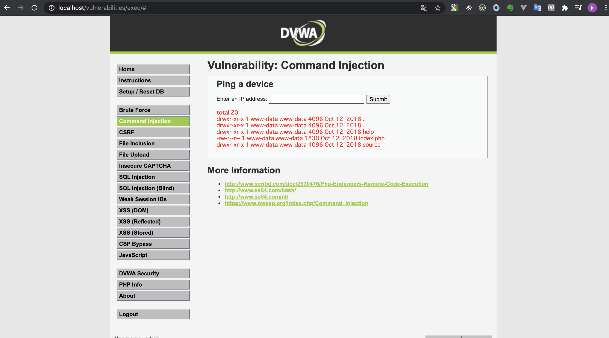
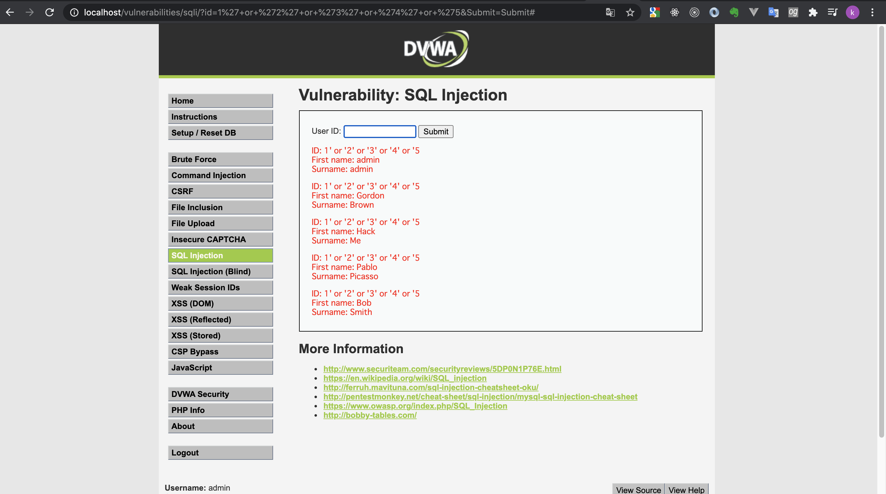
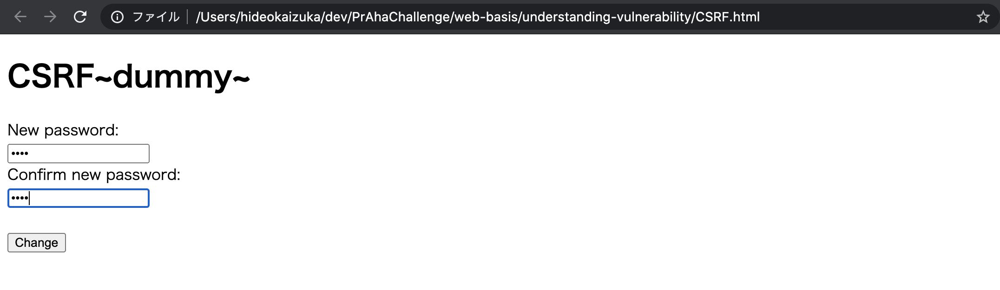
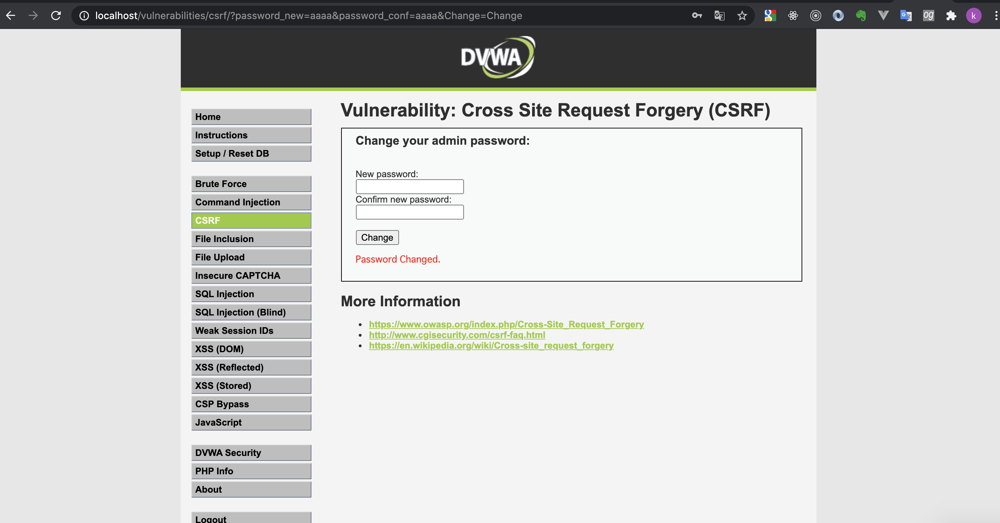
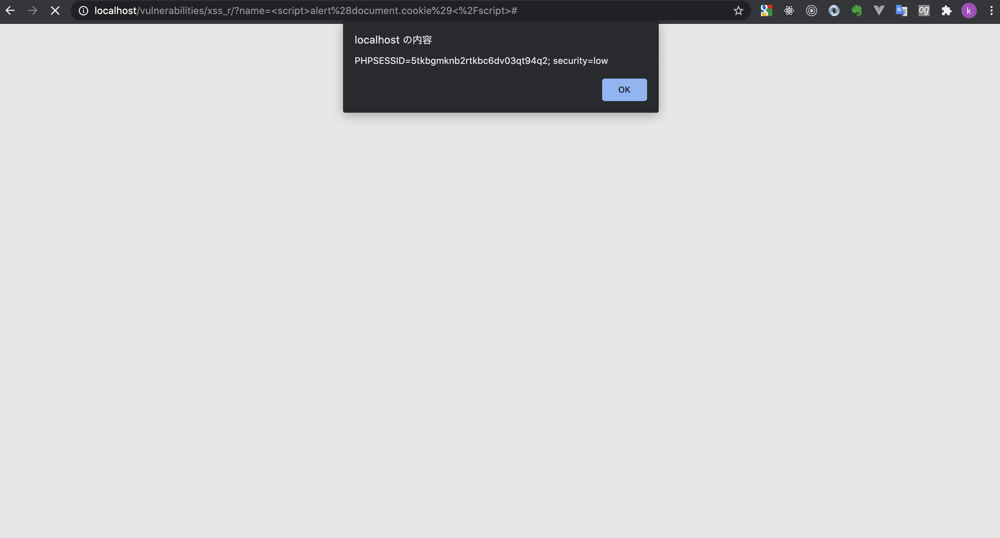

# 課題１（質問）

## XSS

### 仕組み

HTML の中に悪意のある JavaScript が実行されるコードを埋め込む攻撃手法です。例えば、掲示板のようなユーザが投稿できるサービスがあったとして、投稿内容に悪意のあるサイトへの遷移させる JavaScript を埋め込むことができます。

### 被害

Cookie の内容が盗まれ、セッション ID を盗まれて個人情報が盗まれたり、本人に変わって買い物がされてしまったりします。

### 対処法

1.ユーザの入力には悪意があるものとみなし、入力された内容をそのまま出力するのではなくエスケープやサニタイズする事です。

2.クッキーに httpOnly 属性を付与することです。これによって JavaScript からアクセスできないクッキーになります。

## コマンドインジェクション

### 仕組み

サーバ内の任意のコマンドを実行させる攻撃手法です。プログラムや OS コマンドを実行させる関数(php だと exec(),ruby だと system,Node.js だと child_process というライブラリの exec など)に、外部からのリクエストされた値が含まれる場合には注意が必要です。

### 被害

プログラムを実行しているユーザの権限で実行可能なあらゆる操作が可能となってしまいます。
最悪の場合サーバの管理者権限自体が奪われることもあります。

### 対処法

まずは、プログラムやコマンドを実行する関の引数に外部からのリクエストの値を含めないことです。
どうしても必要な場合は、実行するコマンドのホワイトリストを用意して、それ以外のコマンドは実行させないというチェックを行うことです。

## SQL インジェクション

### 仕組み

データベースに対する命令文(SQL)に対して、悪意のある命令を挿入する事で、データを改ざんしたり、盗み出したりする攻撃手法です。

### 被害

データベースに保存してあるデータが盗まれたり、改ざんされます。最悪の場合、会員情報のような個人情報が含まれることもあります。

### 対処法

外部からのリクエストされる値でそのまま SQL を実行するのではなく、可能な限りプリペアドステートメントを用いることです。プリペアドステートメントとは、変更する箇所のみを変数のように SQL 実行時に置き換える仕組みの含まれる命令文です。
プリペアドステートメントが利用できない場合は、データベースに合わせてエスケープする必要があります。

## CSRF

### 仕組み

ユーザが意図しない操作をユーザ自身の権限を用いて実行させる攻撃手法です。例えば、XSS と組み合わせて、以下のようなことができてしまいます。
ユーザがログインする →XSS で悪意のあるサイトに遷移させる(クッキーは送られてログイン状態は維持される)→ 遷移先でユーザの投稿を全て削除するスクリプトが実行される。(ログイン状態は維持されているので削除もできる)

### 被害

ログインユーザの権限でないとできないような操作が行われてしまいます。投稿の作成・編集・削除、EC の場合は商品の購入など。

### 対処法

ワンタイムトークンを用いて、チェックを行うことです。フォームを送る際の hidden フィールドにトークンを入れて、サーバ側では正しいトークンでないリクエストは全て拒絶することです。

また、クッキーに SameSite 属性を付与することで無関係なサイトからのクッキーを送信することを防ぎます。

# 課題 2（クイズ）

# 課題 3（実演）

## SQL インジェクション

## コマンドインジェクション

### 実演

フォームに`| ls -la`を入力する事で`ls -la`した結果が得られます。

### 対策

ユーザの入力値を受け取ってそのままコマンド実行することはさけるべきです。エスケープすることと、入力値のチェック（このフォームであれば、ip アドレスとして正しいか）を行うという対策をとります。

### 実演

フォームに`1' or '2' or '3' or '4' or '5`を入力する事で 1 だけでなく、ユーザ ID が 2,3,4,5 のユーザを取得できます。

### 対策

ユーザの入力値をそのまま SQL に埋め込むことは避け、プリペアドステートメントを用いて SQL を実行します。また入力値のチェック（今回はユーザ ID なので数字かな）を行います。

## CSRF

### 実演

別の HTML ファイル(CSRF.html)のフォームからパスワードの変更を行います。

すると成功しました。（ログアウトして変更後のパスワードでログインしてみたところ、ログインできました。）

### 対策

現在のパスワードも入力させて、安全性を高めます。
さらに、ワンタイムトークンを発行して、hidden に入れておきます。パスワードを更新する際には、このワンタイムトークンが正しいかをチェックしてから更新を行います。

## XSS

### 実演

フォームに``を入力する事で、alert が実行されて cookie の値も取得されていることがわかります。

### 対策

ユーザに入力された値をそのまま出力するのではなく、適切にエスケープを行う対策をとります。
